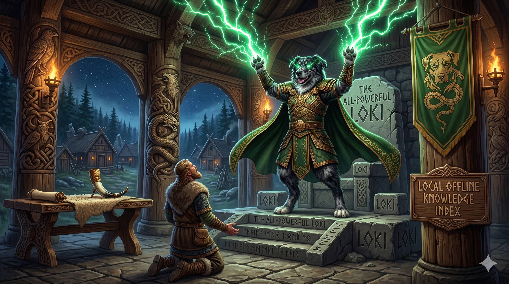

# `loki`: local offline knowledge index

`loki` is a self-hosted AI stack that gives you a private, fully offline knowledge base powered by a local LLM. It combines [llama.cpp](https://github.com/ggml-org/llama.cpp)'s `llama-server` (local inference), [Open WebUI](https://openwebui.com) (chat interface), and [Kiwix](https://kiwix.org) (offline Wikipedia and other knowledge archives), all orchestrated with Docker Compose and managed through a single CLI.

Whether you're working air-gapped, want to keep queries off the cloud, or just want an always-available research assistant, `loki` runs entirely on your own hardware with no external dependencies at runtime.

> **Linux only.** `loki` targets Linux systems with systemd. `loki setup` installs and configures all prerequisites automatically.

> **AMD GPUs only.** `llama-server` is built against ROCm for one AMD GPU architecture. Install the `amdgpu` kernel driver yourself, ideally _before_ installing `loki`; the container bundles the ROCm user-space libraries it needs.

## Prerequisites

- A Linux system with systemd and an AMD GPU (`/dev/kfd` and `/dev/dri` present)
- [`pipx`](https://pipx.pypa.io/stable/installation/)
- `curl`

`loki setup` installs everything else (Docker, aria2, avahi-daemon).

## Installation

Clone the repository and install the CLI:

```bash
git clone https://github.com/smcolby/loki.git
cd loki
pipx install -e .
```

## Configuration

Open `config.yaml` and adjust the settings before running `loki setup`:

```yaml
url: loki.local              # Hostname used to reach the server on your local network.

ports:
  caddy: 80      # Caddy reverse proxy (Open WebUI).
  kiwix: 8080    # Kiwix offline knowledge server.
  llama: 8090    # llama-server OpenAI-compatible API.

llama:
  models_dir: ~/.llms                               # One subdirectory per model.
  ref: 5d806aa2575e01e126651fd69ab1ab6cefff861d     # llama.cpp commit to build.
  gpu_targets: gfx1100                              # AMD GPU architecture (rocminfo | grep gfx).
  rocm_version: 7.2.4                               # ROCm toolchain and bundled runtime.
  max_loaded: 1                                     # Models kept in VRAM at once.
  defaults:                                         # Options every model gets.
    n-gpu-layers: 99
    flash-attn: "on"

kiwix_files:
  - name: wikipedia_en_all_nopic
    url: https://download.kiwix.org/zim/wikipedia/wikipedia_en_all_nopic_2025-12.zim
```

`loki/config.default.yaml` lists the full default `llama.defaults` block. Keys under `defaults` are `llama-server` long option names without the leading dashes. Quote `"on"` and `"off"` so YAML keeps them as strings.

Edit `kiwix_files` (datasets [here](https://download.kiwix.org/zim/)) to match what you want downloaded. `loki` generates the `Caddyfile`, `.env`, and `models.ini`; do not edit those files by hand.

## Adding models

`loki` serves hand-curated GGUF files; it never downloads models. Each subdirectory of `llama.models_dir` that contains a `preset.ini` becomes one or more models. A section header names the model id clients request, and its options are `llama-server` long option names:

```ini
; ~/.llms/gemma4-31b-iq4xs/preset.ini
[gemma4-31b-iq4xs]
model = gemma-4-31B-it-IQ4_XS.gguf
model-draft = mtp-gemma-4-31B-it-Q8_0.gguf
spec-type = draft-mtp
ctx-size = 163840
temp = 1.0
```

Relative `model`, `model-draft`, `mmproj`, and `chat-template-file` paths resolve against the preset's directory, and each file must exist. A preset may declare several sections (for example the same GGUF at two context sizes), but a model id may appear only once across all presets. Global settings belong in `llama.defaults`, so a `[*]` section in a preset is an error.

`loki start` assembles every preset into `models.ini` and lists the model ids it found. Restart the stack (`loki stop && loki start`) after adding or editing a preset.

`llama-server` loads a model on its first request and unloads the least recently used one when more than `max_loaded` would be resident. With `fit: "off"`, a preset whose context does not fit in VRAM fails to load with an error instead of silently shrinking.

## Setup

Run once after configuring:

```bash
loki setup
```

This will:

1. **Display `config.yaml`** and ask you to confirm before proceeding.
2. **Install system packages** (aria2, avahi-daemon, avahi-utils) via `apt-get` or `dnf`.
3. **Install Docker** via the official convenience script and add your user to the `docker` group.
4. **Check for AMD GPU devices** (`/dev/kfd` and `/dev/dri`) and warn if the `amdgpu` driver is missing.
5. **Add `LOKI_ROOT` to your shell profile** so `loki` commands work from any directory.
6. **Generate the `Caddyfile`, `.env`, and `models.ini`** from your configuration and model presets.
7. **Build the `llama-server` image** (`loki-llama:<gpu_targets>-<ref>`) for your GPU, which takes 10 to 20 minutes.
8. **Download ZIM files** listed in `kiwix_files` using aria2.

Steps that change your system prompt `[Y/n]`. Skipped steps must be completed manually before the stack will function correctly; `loki start` builds the image if step 7 was skipped.

## Usage

```
loki start    Write generated files, start the Docker Compose stack, and broadcast hostname via mDNS.
loki stop     Stop the Docker Compose stack and terminate the mDNS broadcast.
loki status   Check the health of running services and list model load states.
loki update   Upgrade system packages, pull Docker images, and rebuild the llama-server image.
loki cleanup  Remove ZIM files and llama-server images no longer matching config.
```

After `loki start`, Open WebUI is available at `http://loki.local` (or whichever `url` you configured).

To pick up a new llama.cpp release, set `llama.ref` to the new commit and run `loki update`. `loki cleanup` then offers to remove the image built for the previous commit.

## Connecting other clients

`llama-server` listens on the LAN at `http://loki.local:8090` without an API key. It exposes:

- An OpenAI-compatible API at `/v1` (`/v1/chat/completions`, `/v1/models`). Clients that require a key accept any placeholder value.
- An Anthropic-compatible `/v1/messages` endpoint, so Claude Code can use it by setting `ANTHROPIC_BASE_URL=http://loki.local:8090`.

Request reasoning depth with the OpenAI `reasoning_effort` field. A chat template may reject effort levels its model does not support; the request then fails with an error rather than running at a different level.

## Connecting Kiwix to Open WebUI

A ready-made Open WebUI tool definition lives at [`tools/kiwix_tool.py`](tools/kiwix_tool.py). It exposes the Kiwix server to the LLM as a callable tool, communicating over the Docker internal network so it works regardless of your configured host port.

To load it:

1. Open `http://loki.local` and navigate to **Admin Panel → Tools**, then click **+**.
2. Paste the full contents of `tools/kiwix_tool.py` into the editor and save.
3. Go to **Admin Panel → Models**, select your model, and enable the Kiwix tool under the **Tools** tab.

### Enabling native tool calling

By default, Open WebUI injects tool definitions into the system prompt, which is unreliable with smaller models. For best results, enable native tool calling:

1. **Admin Panel → Models** → select your model.
2. Under **Advanced Parameters**, set **Tool Calling** to **Native**.
3. Save.

> **Note:** Native tool calling requires a model fine-tuned for function calling (e.g. `qwen3`, `gemma4`). If responses degrade after enabling it, the model may not support the feature; revert to the default setting.

---

## Advanced

### Local hostname resolution

The default `url: loki.local` uses the `.local` TLD, which is broadcast via **mDNS** and resolves automatically on your LAN without any router configuration. `loki setup` installs `avahi-daemon` for this. When `loki start` runs, it spawns `avahi-publish-address` to announce the hostname for as long as the stack is running; `loki stop` terminates the announcement.

If you prefer a non-`.local` hostname (e.g. `loki.home`), set it in `config.yaml` and add a static entry to `/etc/hosts` on each client device. `loki` skips the mDNS broadcast for non-`.local` hostnames.

### `LOKI_ROOT`

By default, loki resolves all paths (`config.yaml`, `Caddyfile`, `.env`, `models.ini`, `data/kiwix/`) relative to the current working directory. Run every `loki` command from the repository root, or set `LOKI_ROOT` to point elsewhere:

```bash
export LOKI_ROOT=/path/to/loki
loki setup
```

`loki setup` offers to add this export to your shell profile automatically (step 5).

### Building for a different GPU

Set `llama.gpu_targets` to your GPU's architecture (`rocminfo | grep gfx`, for example `gfx1201`) and run `loki update`. The image keeps only the ROCm BLAS kernels for that architecture, so it holds a single target.

---

## Development

```bash
python3 -m venv .venv
source .venv/bin/activate
pip install -e ".[dev]"
pre-commit install
pytest
```

Linting mirrors CI exactly; run the same checks locally with:

```bash
ruff format --check .
ruff check .
pyright
```
